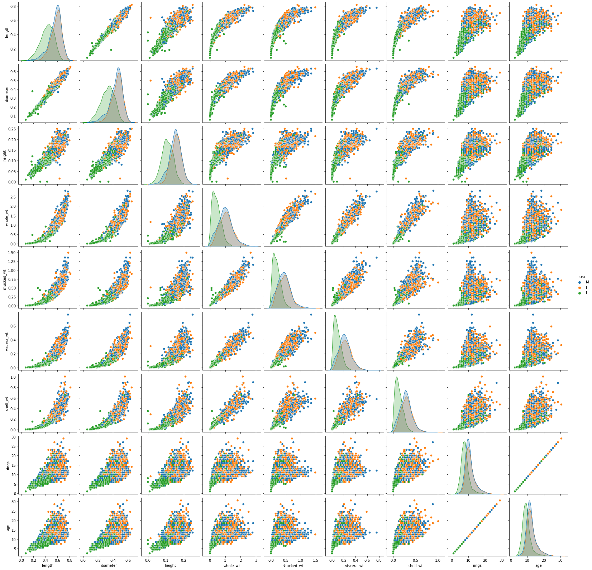

## Abalone Analysis

The abalone dataset consists of the following data:
- "sex" - M, F, and I (infant)
- "length" - longest shell measurement (mm)
- "diameter" - perpendicular to the length (mm)
- "height" - measured with meat in the shell (mm)
- "wholewt" - whole abalone weight (g)
- "shuckedwt" - the weight of abalone meat (g)
- "viscerawt" - gut-weight (g)
- "shellwt" - the weight of the dried shell (g)
- "rings" - number of rings in a shell cross-section
- "age" - the age of the abalone: the number of rings + 1.5

**Full analysis can be found in [abalone.ipynb](abalone.ipynb)**

### Initial Exploration

A pairplot was generated to easily visualize the relationship of each numerical variable with each other.

### How does age relate to the amount of meat present in an abalone?   Does the rate of growth slow after a certain point?

There is an apparent logarithmic relationship between age and the amount of meat present in the abalone (shucked_wt). The meat content of abalones increase rapidly until around 9.5 years of age where the rate of growth slows down until it plateaus.

### Do the shell and meat grow at different rates?

Linear trend lines for both variables was plotted for ease of comparison. The trend lines look parallel but we can see a slightly more steeper line for the 'shucked_wt' variable. Comparing the equations of the two lines show the meat weight increases by 6.95% faster than shell weight.

### Determine and rank the variables that have the most impact on the amount of meat present in an abalone.

A heatmap of variable correlations was done for an initial view of each relationship with 'shucked_wt'. 

A linear regression model was created and the resulting coefficients from the equation was used to compare the impact of each variable.

The model excluded the following variables:
- 'whole_wt', 'viscera_wt', 'shell_wt': The weight variables are too correlated with 'shucked_wt' which will affect the model. The weight variables are also somewhat redundant already with 'shucked_wt'
- 'sex_I': Dummy variables were created for the 'sex' column. 'sex_I' was removed as it can be said to be influenced by the 'age' column.
- 'rings': Redundant variable to 'age'

The model resulted into:

| Rank  | Variable |
| :---  | :----    |
| 1     | length   |
| 2     | diameter |
| 3     | height   |
| 4     | age      |
| 5     | sex      |
